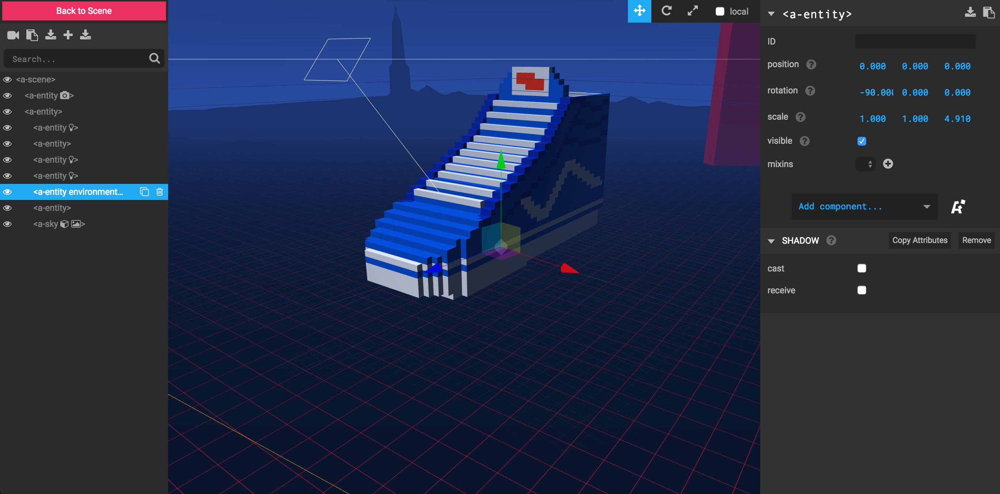
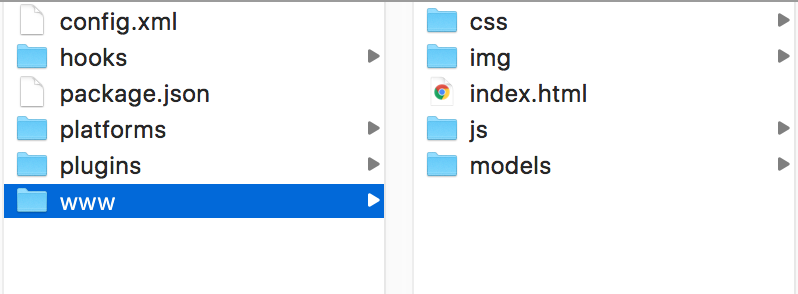
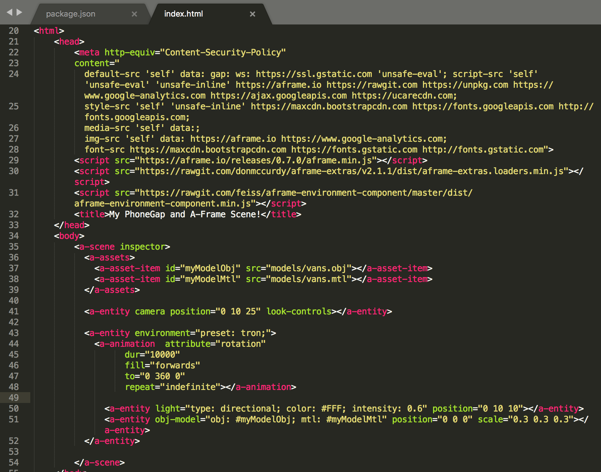

# What is A-Frame?


From the [A-Frame website](https://aframe.io/docs/0.7.0/introduction/#what-is-a-frame):

A-Frame is based on top of HTML, making it simple to get started. But A-Frame is not just a 3D scene graph or a markup language; the core is a powerful entity-component framework that provides a declarative, extensible, and composable structure to three.js.

## Features:
* **Simple Installation:** All that is required to start using A-Frame is a `<script>` that points to the A-Frame js file and then use the `<a-scene>` tag in your HTML. 

* **Use Declarative HTML:** Construct your scenes using HTML tags that represent certain objects in the scene. 

* **Cross-Platform:** The power of the web allows us to use A-Frame practically anywhere that supports a browser with WebGL. 

* **Visual Inspector:** A powerful visual 3D inspector that allows you to debug your scenes. Use it on any A-Frame with the key-command: `<ctrl> + <alt> + i`.

More listed features at the [A-Frame website](https://aframe.io/docs/0.7.0/introduction/#features).

What I personally like about A-Frame is that it really simplifies the process of making WebVR sites. Without A-Frame, you would have to venture into the WebVR land and code scenes using [three.js](https://threejs.org/) or perhaps even just straight up [WebGL](https://developer.mozilla.org/en-US/docs/Web/API/WebGL_API). This might be fine for those who are more well versed in coding 3D, but this is quite a daunting task for those looking to wet their feet. 

## Working with PhoneGap
Since A-Frame is all web based, it works pretty well with PhoneGap! Aside from some annoying CSP-issues, it should work out of the box fairly well. I haven't personally seen much outside of demos of A-Frame and PhoneGap, but perhaps one of you will change that. Let's see some VR apps made with PhoneGap, eh?

In this workshop, we'll clone down the `phonegap-magicavoxel-aframe-template` that has a small premade A-Frame project ready to go. Once your models are ready to be viewed on your phone, we'll import them into the template and then use `phonegap serve` to connect our phones to the A-Frame project. 

## Let's Start our PhoneGap Project!
Enough with words, code time now! First things first, let us create our PhoneGap project using a template:
`$ phonegap create myVoxelProject --template phonegap-magicavoxel-aframe-template`

And if all goes successfully, our PhoneGap project directory structure should look something like:


Let's open up the `www/index.html` file and see what's going on in there. Take notice of a few things:


* A large CSP: this is to get A-Frame working within `phonegap serve` - once you start making your own projects, copy this one down to help you get going.
* Script tags that point to the A-Frame js file and a couple of other files that'll help fill out the scene with some presets
* `<a-scene>`: notice how all the things within our scene are within this tag? 
* `<a-asset>`: this tells A-Frame to preload and cache these resources. Really handy when dealing with large files or a large amount of assets.
* `<a-entity camera position="0 10 25" look-controls>`: this is our scene's camera. Think of it as the lens of which we view the scene through. The position component is where we have placed our camera in the scene. 
* `<a-entity environment="preset: tron;">`: This is a preset world where we are going to place our models in. Looks cool and beats figuring out some of the lighting presets. 
* `<a-animation>` - this is a neat little visual addition so that we can see our model spin around in the world. Notice how it is a child element of the tron environment. That means everything placed under the tron enivorment will spin around.  
* `<a-entity light="type: directional...` - adds a directional light to the scene
* `<a-entity obj-model="obj: #myModelObj; mtl: #myModelMtl" position="0 0 0" scale="0.3 0.3 0.3">` - this is the actual reference to our model and adding it the scene. Notice how the scale is set to `0.3`. You may have to adjust this depending on the size of your model.

## Placing your Model into the Scene
When you exported your `.obj`, `.mtl` and `.png` files from MagicaVoxel, make sure to place them into the `www/models/`. Then simply change the reference in `index.html` to match the file names of your model. 
```
<a-assets>
    <a-asset-item id="myModelObj" src="models/vans.obj"></a-asset-item>
    <a-asset-item id="myModelMtl" src="models/vans.mtl"></a-asset-item>
</a-assets>
```

## Viewing your Model on your Browser
Now let's see if everything is working ok. `cd` into your PhoneGap project's directory and type `phonegap serve`. This should start up a server that will broadcast an ip address for your laptop and phone to connect to. It should look something like this:
```
$ phonegap serve
[phonegap] starting app server...
[phonegap] listening on 10.58.143.112:3000
[phonegap] listening on 169.254.196.197:3000
[phonegap] 
[phonegap] ctrl-c to stop the server
[phonegap] 
```

Copy and paste the address where the server is listening into your browser. If all goes well, you should see your model rotating in the scene. 

## Viewing your Model on your Phone
* Make sure your phone isn't locked into protrait mode so we can view in landscape. 
* Open up the PhoneGap Developer App on your phone and type in the address from the server. It should begin to extract the project and deploy onto your phone. 
*  Once it's loaded, hit the cardboard icon to launch into VR mode. 
* Place your phone into one of the Google Cardboards and see your model in full 3D!

### Troubleshooting
* If the model appears all white, then you need to make sure you copied over that `.png` file into your `www/models/`. 
* If the model doesn't appear at all, use the A-Frame inspector to see if it actually exists in the scene. It might be too large or too small for you to see so you may need to scale the model accordingly. 
* If you can't get the PhoneGap Developer App to connect, you can try opening up your browser on your phone and going to the address. 

## Moving Forward
That pretty much concludes this workshop. I hope you enjoyed learning how to make your own 3D assets and viewing them in WebVR on your phone! Here are some fun things to try:

* Change the environment presets: `<a-entity environment="preset: tron;">` to any of these:
* Change the animation of the scene by changing the `dur` or `to` in `<a-animation  attribute="rotation" dur="10000" fill="forwards" to="0 360 0" repeat="indefinite"></a-animation>`
* Add more models to your scene.