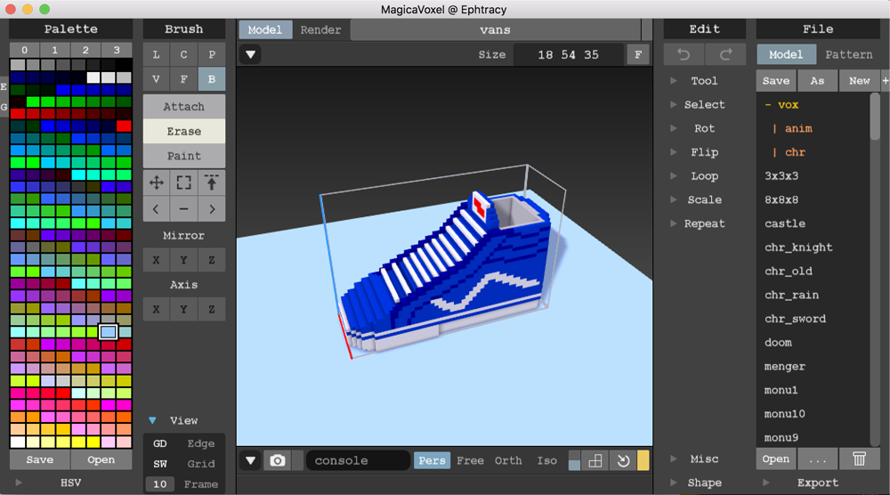
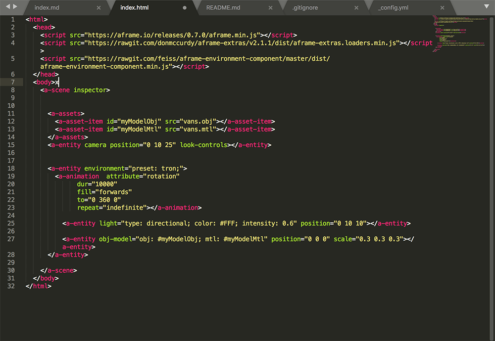
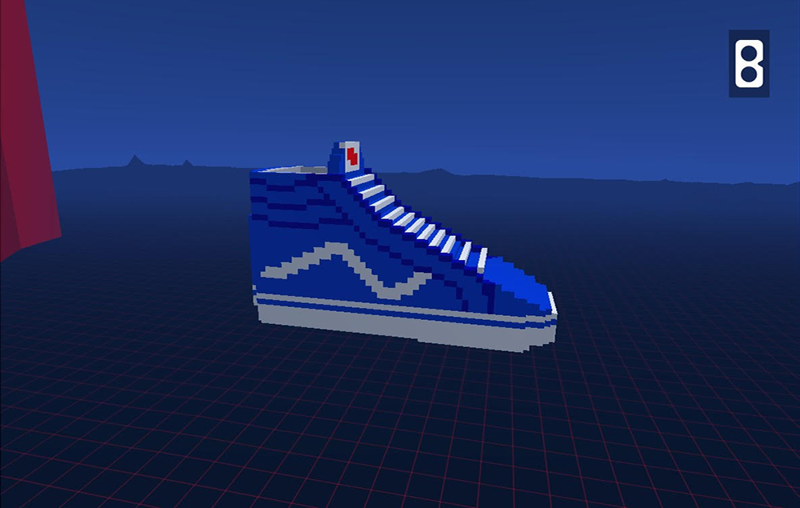

# Introduction
Greetings fellow voxel/mobile enthusiast! Have you been wanting to make 3D art but have been stumped by overly complicated tools and expensive software? Perhaps you are wondering how one can easily make 3D art and view it on your phone? 

Well look no further! In this workshop, we will go over how to make models in MagicaVoxel and then export them to your phone using a few bits of software and some elbow grease!

## Basic Overview

### 1. Make your model in MagicaVoxel

### 2. Add the references to your model

### 3. View your model in WebVR on your phone!

# Requirements
- MagicaVoxel available here: [https://ephtracy.github.io/](https://ephtracy.github.io/)
- Preferably, a mouse to draw with
- Google cardboard 
- PhoneGap Developer App: [iOS App Store](https://itunes.apple.com/app/id843536693) or [Google Play Store](https://itunes.apple.com/app/id843536693)
- phonegap-magicavoxel-aframe-template

### Let's get started!
[Learning MagicaVoxel](magicavoxel.md)