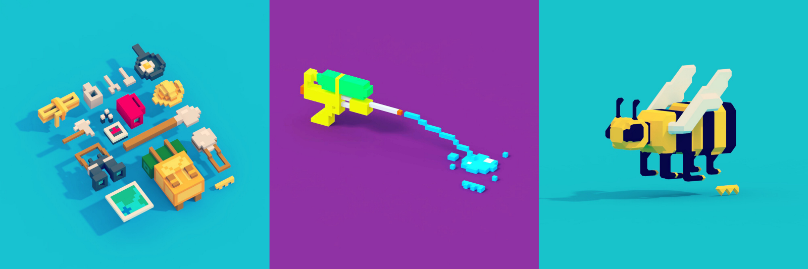
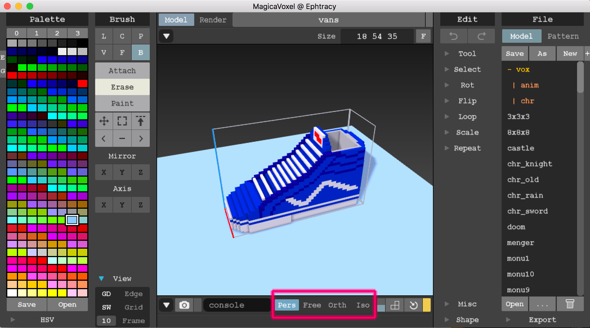
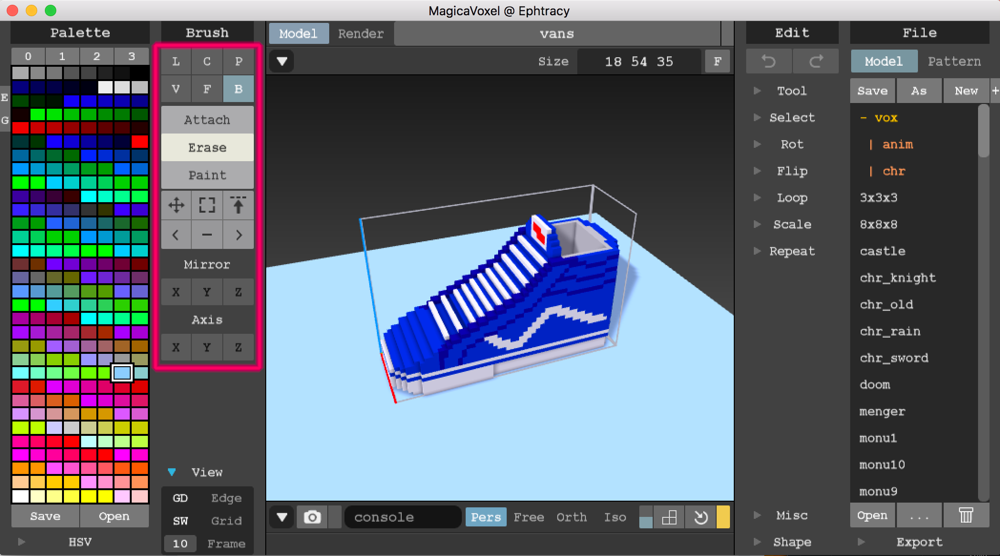
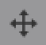
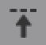

# What is MagicaVoxel?
MagicaVoxel is a free 3D modeling software that is designed for ease of use and fun! Everything in MagicaVoxel is built out of cubes or voxels. Think pixel art but in 3D! No worrying about polygons, faces, vertices and textures. Stack your voxels upon another, change their colours, and make something cool!

_**tldr: building stuff in MagicaVoxel is like building stuff with lego**_

#### Some cool stuff I've personally made:

As far as I can tell, it is made by one person named [@ephtracy](https://twitter.com/ephtracy) and is hosted at [https://ephtracy.github.io/](https://ephtracy.github.io/). If you haven't done so already, please download and install MagicaVoxel to continue with this workshop: [https://ephtracy.github.io/](https://ephtracy.github.io/).

## Camera Controls
To navigate around your model, you'll primarily be using the `right click` button, the `space` key, and the `scroll wheel`. There are also keyboard commands, but I find that using a mouse is more intuitive. 

#### Moving the Camera Around
* **Rotate:** Hold down `right-click` to rotate the camera around. Or use `a` & `d` to rotate left and right and `q` & `e` to rotate up and down. 
* **Zoom:** Use the `scroll wheel` to zoom in or out. Or use `w` & `s`. 
* **Pan:** Hold down `space` and `right-click` to move your camera around the scene. Or you can hold down and use `scroll-click` to achieve the same effect. 

#### Changing Camera Modes

For the purpose of this tutorial, we shall keep our camera in `Pers` or **Perspective** mode. However, you can change to `Free` in order to move the camera around like you would in a FPS (WASD controls). Switching to `Orth` or `Iso` switches the camera's projection to be _orthographic_ which means parallel lines never visually meet. Use this mode to simulate isometric graphics. 

To note: exporting your model in `Pers`, `Orth` or `Iso` will not preserve the camera's setting when viewing it in WebVR! To emulate those camera modes, you will need to set that up on the A-Frame/WebVR side!

## Adding/Removing/Painting Voxels

MagicaVoxel offers six tools to help place and remove voxels. With a brush selected, you can **Attach**, **Erase**, or **Paint**. Here's a quick description of each brush starting with the most important ones:

* **B Box Mode:** Simply click to start lay down a voxel. Click and drag in a particular direction to lay a sheet of voxel down.
* **F Face Mode:** Add onto an existing face of a voxel model. Use this tool to add on a sheet of voxels onto an existing face while preserving colours or geometry.
* **P Pattern Mode:** If you have a model that's saved to another file and also you'd like to stamp clone it into the scene you're working on, use this tool. Make sure to select the **Pattern** on the far right side of the file explorer to select which pattern you want to clone.
* **C Center Mode:** A brush that lets you draw squares or circles starting from the center.
* **V Voxel Mode:** A brush that allows you to quickly plop down cubes and spheres of a defined size.
* **L Line Mode:** A brush that allows you to drag and make lines of voxels.

Pro-tip: When making your models, you may want to consider using the **Mirror** or **Axis** brush modifiers. I personally always mirror on one plane so I don't have to constantly repeat my work. 

## Selecting and Moving Voxels

So you've placed some voxels down and then you realise some are out of place or maybe you've made your model too large or too small. Use these tools to help move and select your voxels around. 

* : Use this tool to move selected voxels or the whole model around in the view. To note: your model will wrap around if you try and move parts of it out of bounds. 
* : This tool is made for selection voxels. You can select voxels as you would lay them down in Box Brush mode or use the Rect option to select all voxels that fit within a rectangle selection.
* : Much like the selection tool but instead select according to the Face or Volume. Works pretty much like Face Brush mode. 

